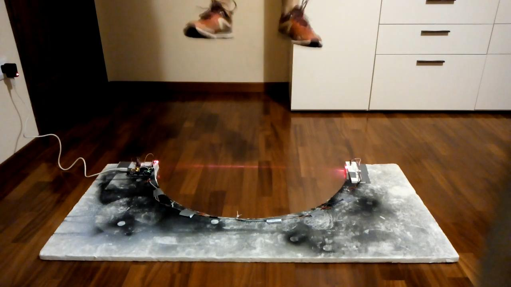

# Bosco Test
Bosco tests are designed to assess the morphofunctional characteristics of one's legs muscles as well as their neuromuscular skills.

## Acknowledgements
Many thanks to Camilla M. Asioli, for her diligent work, and Alice Viglino, for
her enthusiastic efforts.

## Components and supplies
- [Arduino Mega 2560](https://store.arduino.cc/arduino-mega-2560-rev3) × 1. Actually, pretty much any Arduino board would do just fine.
- [Breadboard (generic)](https://www.newark.com/multicomp/mcbb400/breadboard-solderless-abs/dp/99W1759?COM=ref_hackster) × 2
- [Jumper wires(generic)](https://www.newark.com/adafruit/759/wire-gauge-28awg/dp/88W2571?COM=ref_hackster) × 30.
  Please consider the quantity indicated above a generic rule of thumb.
- [ICStation KY-008 Laser Transmitter Module](https://www.amazon.com/s?k=ICStation+KY-008+Laser+Transmitter+Module) × 1
- [Photo resistor](https://www.adafruit.com/product/161) × 1
- [Resistor 10k ohm](https://www.newark.com/multicomp/mccfr0w4j0103a50/carbon-film-resistor-10kohm-250mw/dp/58K5002?COM=ref_hackster) × 1
- [HC-05 Bluetooth Module](https://www.amazon.com/HiLetgo-Wireless-Bluetooth-Transceiver-Arduino/dp/B071YJG8DR) × 1
- Android device × 1

## Apps and online services
- [Arduino IDE](https://www.arduino.cc/en/main/software)
- [MIT App Inventor 2](http://appinventor.mit.edu/)

## About this project

### Why the Bosco test?
Even though several similar products are already available on the market, their price range is often ridiculously high for a sports club
trying to run a simple physical fitness test. As high school students practicing sports after school, we decided to do something about it.
After a little bit of researching on the net, we realized that most of the sensors and data usually featured by such systems aren't even
taken into consideration by your everyday athlete. Our new goal: to start cutting down on every unneeded asset.

### How does it work?
A laser barrier detects whether the athlete's feet are currently touching the ground or not. For every jump, the delay between two
"touching-the-ground" instants is memorized as the ToF (time of flight) for that particular jump. Finally, this information is sent via
Bluetooth to a connected Android device, which deducts the JH (jump height) using a simple formula (g being the
[gravitational acceleration](https://en.wikipedia.org/wiki/Gravitational_acceleration):

> JH = (ToF ^ 2 * g) / 8

### Assembling your circuit
See [here](https://create.arduino.cc/projecthub/camice-foxyseta/bosco-test-a90dd3#toc-assembling-your-circuit-2).

### Uploading the sketch
Follow these simple steps to upload your sketch:
1. create a folder named "test_di_bosco" in your sketchbook folder
2. download the six source files embed below inside your new "test_di_bosco" folder
3. open `test_di_bosco.ino` using Arduino IDE: a single window with all of the `.ino` files in it should open
4. that's it: you are now ready to upload the entire sketch clicking on "upload" once

### A sample Android application
We chose to use MIT App Inventor 2 (see Apps and online services) to develop our
[sample application](http://ai2.appinventor.mit.edu/?galleryId=5968109044891648) (available for free).

### Running the test
Watch on [YouTube](https://www.youtube.com/watch?v=tT6VMa4bKXE).
